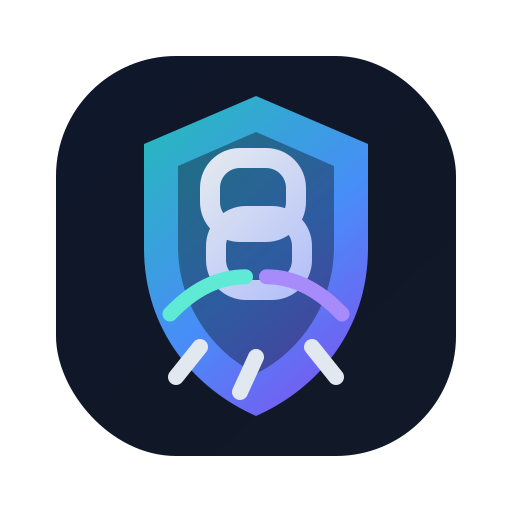

<div align="center">
  
  <h1>ClawChain</h1>
  <p><strong>Secure, recoverable, and fully traceable runtime for high-privilege AI coding agents.</strong></p>
  <p>
    ClawChain protects agent runtimes against opaque execution, lost evidence, incomplete recovery,
    and weak post-incident traceability.
  </p>
</div>

<p align="center">
  
  
  
  
</p>

## Overview

Modern terminal agents such as Codex, Claude Code, Gemini CLI, Cursor, and future high-permission agent systems can modify a host machine quickly, broadly, and sometimes opaquely. Once a destructive command lands, teams usually face four immediate problems:

- execution was not transparently captured
- evidence is incomplete or easy to lose
- recovery is partial or unreliable
- post-incident traceability is weak

**ClawChain** is a runtime layer that addresses those problems with one unified workflow:

- discover live agent sessions
- route a session into a controlled execution path
- detect dangerous operations
- preserve recovery material for destructive delete actions
- export per-session proof logs
- anchor key proof fields to a blockchain backend and verify them later

## What ClawChain Solves

ClawChain is not just a session dashboard. It is meant to be the safety control plane for high-privilege AI agent execution.

### Core Guarantees

- **Safer execution**
  - sessions are onboarded into a controlled launcher path rather than left fully opaque
- **Recoverability**
  - destructive delete actions can generate recovery material and be restored
- **Per-session evidence**
  - proof export is scoped to one monitored session, not mixed across the whole project
- **Traceability**
  - critical proof fields can be checked against the configured EVM chain backend

### Core Threat Model

ClawChain is designed for the practical risks introduced by high-permission coding agents:

- `rm -rf` style deletion
- destructive shell actions hidden inside long interactive sessions
- incomplete logs after a failure or interruption
- difficulty proving what happened after the fact

## Current Scope

The current stable system is intentionally narrow and reliable.

### Stable Today

- **Codex** is the primary supported end-to-end path
- `Join Monitor` + `Copy Resume Command` are the main onboarding flow
- delete detection, snapshot-backed recovery, proof export, and chain verification are working together

### In Progress

The broader multi-agent surface is being expanded, but not all of it should be treated as equally mature yet.

- Claude Code: integration in progress
- Gemini CLI: integration in progress
- Cursor: integration in progress
- OpenClaw and future agent runtimes: planned extension path

## Risk Model

ClawChain currently uses a deliberately simple two-class model:

- **restorable risks**
  - currently only `Delete / Remove`
- **audit-only risks**
  - recorded and exported for evidence, but not part of the restore path

This is by design. The project prioritizes making the delete workflow dependable rather than claiming broad but fragile recovery support for every risk type.

## Architecture

ClawChain is organized around four layers:

1. **Session Monitoring**
   - discovers live agent sessions and identifies the active session path
2. **Controlled Execution**
   - routes the session into a managed launcher / controlled resume flow
3. **Recovery & Proof**
   - captures snapshots, impact-sets, receipts, submissions, and per-session proof material
4. **Chain Verification**
   - anchors key commitment fields and verifies them later against the configured EVM backend

## Repository Layout

- `clawchain/`
  - main runtime, UI, monitoring, recovery, proof, and chain logic
- `contracts/`
  - EVM commitment anchor contract and ABI
- `scripts/`
  - local devnet and contract deployment helpers
- `demo/delete-smoke/`
  - tiny smoke assets for delete / restore validation
- `requirements.txt`
  - minimal Python dependencies for runtime and local validation

This export intentionally excludes benchmark assets, internal tests, historical run artifacts, caches, and research-only modules.

## Quick Start

### 1. Create an Environment

```bash
conda create -y -n ClawChain python=3.12 pip
conda activate ClawChain
```

### 2. Install

```bash
cd <repo-root>
pip install -r requirements.txt
pip install -e .
```

### 3. Start the UI

#### Same-machine local testing

Use loopback binding when the browser is on the same host:

```bash
python -m clawchain.agent_proxy_cli ui --host 127.0.0.1 --port 8888
```

Open:

```text
http://127.0.0.1:8888
```

#### Remote access from another machine

Bind on all interfaces only when you intentionally want remote access:

```bash
python -m clawchain.agent_proxy_cli ui --host 0.0.0.0 --port 8888
```

Then open the actual host IP from the browser:

```text
http://<host-ip>:8888
```

Important:

- `0.0.0.0` is a bind address, not a browser URL
- if `8888` is already in use, switch to another port such as `8889`
- on the same machine, prefer `127.0.0.1`

### Platform Notes

#### Linux / macOS

You can use either direct Python startup or the helper shell script:

```bash
bash run_clawchain_ui.sh 8888
```

The helper script is included in the repository root and is intended for Unix-like systems. It defaults to `HOST=127.0.0.1` and can be overridden, for example: `HOST=0.0.0.0 bash run_clawchain_ui.sh 8888`.

On macOS, the monitored Codex launcher and handoff artifacts remain shell scripts and the UI will emit `bash ...` resume / handoff commands.

#### Windows

You can use either the batch helper or direct Python startup:

```bat
run_clawchain_ui.cmd 8888
```

or:

```bash
python -m clawchain.agent_proxy_cli ui --host 127.0.0.1 --port 8888
```

On Windows, the monitored Codex launcher and handoff artifacts are generated as `.cmd` files and the UI will emit `cmd /k ...` or `cmd /c ...` commands instead of `bash ...`.

ClawChain does not require `pgrep` on Windows. The host monitor now falls back to a PowerShell process scan that prefers CIM when available and degrades to `Get-Process` when CIM command-line access is blocked.

For monitored Codex sessions, ClawChain now runs a background rollout watcher from the local `service-start` process. On both Windows and macOS/Linux, it watches Codex `rollout-*.jsonl` tool calls in real time and, for risky `shell_command` / delete-style `apply_patch` actions, it plans recovery before the tool output is recorded so the session can produce recovery catalogs, receipts, submissions, and proof cards instead of UI-only fallback history.

## End-to-End Workflow

### Step 1. Start a Codex session

Launch a fresh Codex session as usual.

### Step 2. Onboard it into ClawChain

In the UI:

1. find the new session card
2. open `Session Detail`
3. click `Join Monitor`
4. click `Copy Resume Command`

`Join Monitor` now starts the per-session ClawChain background service by default. If that service is missing, the monitored session can still appear in the UI, but it will fall back to history-only records instead of producing recoverable proof artifacts.

### Step 3. Enter the controlled session

Run the copied command in a terminal. That command re-enters the same session through the controlled runtime path.

Platform-specific note:

- Linux / macOS: the copied resume command will be a `bash .../codex-with-clawchain ...` command
- Windows: the copied resume command will be a `cmd /k ...\\codex-with-clawchain.cmd ...` command

### Step 4. Perform a delete action

Run a delete action from inside the controlled session.

Important: perform the delete only after `Join Monitor` has completed and the copied resume command has relaunched the session through the monitored launcher. That is what allows the rollout watcher to capture the dangerous tool call and build a recoverable proof package.

### Step 5. Validate the result

Return to the UI and confirm:

- the new delete appears in `Dangerous Operations`
- the record is not `No Snapshot`
- `Restore` is available
- `Download Proof Log` includes non-empty `proof_cards` and the session evidence paths point into `runtime/local` and `recovery-vault`

### Step 6. Restore the deletion

Click `Restore` and verify the deleted target is back on disk.

### Step 7. Export proof

Use `Download Proof Log` in `Session Detail` to export a per-session proof JSON.

### Step 8. Verify on chain

```bash
conda run -n ClawChain python -m clawchain.agent_proxy_cli chain-verify <account-id> --session <SESSION_ID>
```

## Delete / Restore Smoke Test

Prepare a tiny target:

```bash
mkdir -p demo/delete-smoke/tmp-delete
echo hello > demo/delete-smoke/tmp-delete/a.txt
echo world > demo/delete-smoke/tmp-delete/b.txt
```

Then, from the monitored Codex session, delete:

```text
demo/delete-smoke/tmp-delete
```

After deletion:

1. verify the record appears in `Dangerous Operations`
2. click `Restore`
3. confirm the folder is back on disk

Disk verification:

```bash
ls -R demo/delete-smoke/tmp-delete
```

## Proof Export

`Download Proof Log` exports a **session-scoped** JSON file containing:

- session metadata
- dangerous operations for that session
- live activity for that session
- proof cards for that session
- a concise security model summary

ClawChain also keeps an encrypted local proof archive for integrity and retention.

## Chain Verification

Account-level chain overview:

```bash
conda run -n ClawChain python -m clawchain.agent_proxy_cli chain-status <account-id>
```

Session-level chain verification:

```bash
conda run -n ClawChain python -m clawchain.agent_proxy_cli chain-verify <account-id> --session <SESSION_ID>
```

Important:

- `chain-status` is an account-level overview
- `chain-verify --session ...` is the session-specific validation command

## Current Boundaries

ClawChain currently does **not** claim:

- restore coverage for every dangerous operation type
- polished full support for every non-Codex agent path
- stronger-than-host-account OS isolation for local encrypted artifacts
- full benchmark publication in this export

The current emphasis is practical stability for monitored delete detection, restoration, proof export, and chain verification.

## Acceptance Checklist

A clean installation is considered healthy if all of these succeed:

1. create and activate the `ClawChain` conda environment
2. `pip install -r requirements.txt && pip install -e .`
3. start the UI on port `8888`
4. onboard a Codex session with `Join Monitor`
5. enter the controlled session through the copied resume command
6. perform one delete
7. see a restorable delete record in `Dangerous Operations`
8. restore the deleted target
9. run `chain-verify --session <SESSION_ID>` successfully

If these nine steps pass, the exported repository is functioning correctly.
