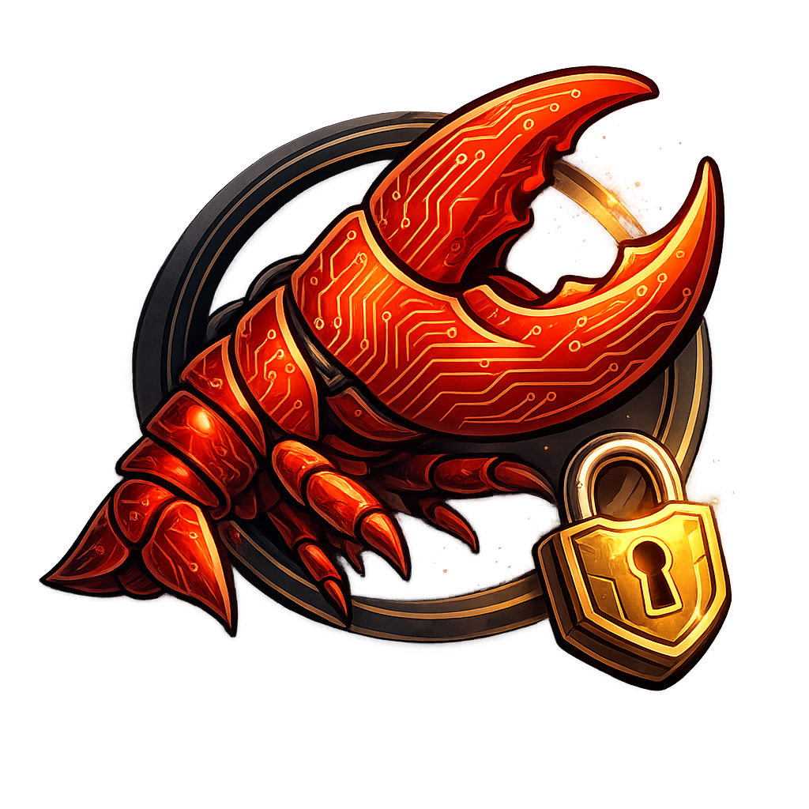
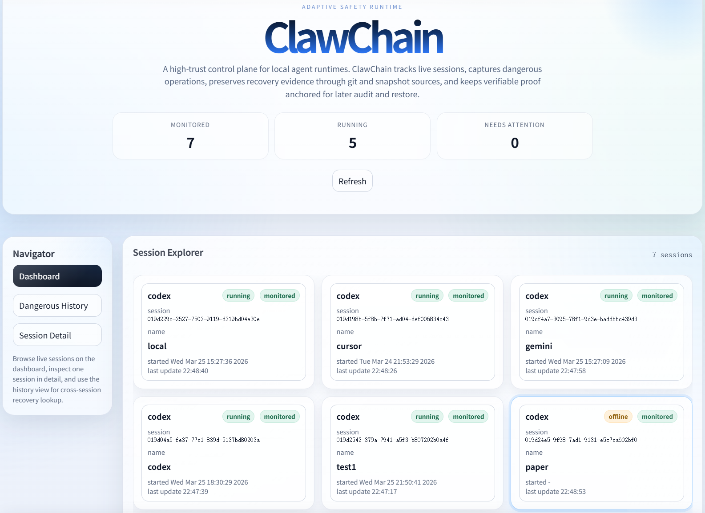

<div align="center">
  
  <h1>ClawChain</h1>
  <p><strong>面向高权限 AI Coding Agent 的安全、可恢复、可追溯运行时控制层。</strong></p>
  <p>
    这个隔离仓是 ClawChain 通用 shell-agent adapter 层的集成实验仓，用来把 ClawChain 从 Codex 主路径扩展到更多 agent。
  </p>
  <p>
    <a href="README.md">English</a> · <a href="DEVELOPER.md">开发者文档</a>
  </p>
</div>

<p align="center">
  
  
  
  
</p>

## Dashboard

<p align="center">
  
</p>

这个 dashboard 是 ClawChain 的主要操作界面，用于发现会话、`Join Monitor`、查看危险操作、执行恢复、导出 proof，以及检查链状态。

## 这个仓库的定位

这不是主仓的稳定发布版本。

这个仓库是隔离出来的集成分支，用来把原本偏 Codex 的接入方式抽象成可扩展的 shell-agent 控制层，并在不影响主仓的前提下先验证真实的 Claude Code 主链路，再准备回并主仓。

## ClawChain 要解决什么问题

高权限 coding agent 可以直接在真实机器上执行命令，这会带来四类非常现实的问题：

- 执行过程不透明
- 证据容易丢失
- 破坏操作后的恢复不完整
- 事后排查和溯源困难

ClawChain 的目标，就是把这类会话转成一个可监控、可恢复、可导出 proof、可链上校验的受控运行环境。

## 这个分支已经验证的内容

### 当前稳定并已验证

- Codex 主路径在 adapter 重构后已经做过回归检查。
- Claude Code 已经接入新的通用 shell-agent adapter 层。
- Claude Code 已完成 `Join Monitor -> delete -> Restore -> proof -> verify` 端到端验证。
- Linux 和 Windows 的 setup、service、UI 以及本地 EVM bootstrap 已在这个分支验证通过。

### 正在推进

- Gemini CLI 会在同一套 adapter 层之上继续接入。
- 后续其他 shell 风格 agent 可以通过注册 agent profile 接入，而不需要复制 Codex 的专用逻辑。

## 这个分支相对主仓的核心变化

- 抽象出通用 shell-agent profile 层，用于 launcher、resume、handoff 和环境注入
- Claude Code 改为走共享 adapter 路径，而不是继续堆在 Codex 专用逻辑上
- 强化了 Claude session id 识别和接管逻辑
- 修复了 mixed native/managed terminal、session card 串号等 UI 问题
- 在 Linux 上减少了昂贵的进程元数据调用，提升 live session 检查速度

## 核心能力

- 发现正在运行的 agent 会话
- 将会话纳入受控监控路径
- 捕获删除类高危操作
- 保留基于 snapshot 的恢复材料
- 恢复被影响的文件或目录
- 导出可读 proof 日志
- 在本地或 EVM 后端上校验 proof 字段

## 环境要求

- Python 3.12
- `pip`
- Git
- 如果需要本地链锚定：
  - 优先使用 Foundry：`anvil`、`forge`
  - Docker 仅作为可选兜底

## 安装

```bash
conda create -y -n ClawChain python=3.12 pip
conda activate ClawChain
cd <repo-root>
pip install -r requirements.txt
pip install -e .
```

## 快速部署

### Windows

```bat
setup_clawchain.cmd 8888
```

### Linux / macOS

```bash
bash setup_clawchain.sh 8888
```

setup 会自动完成这些动作：

1. 停掉旧的 ClawChain service
2. 创建或刷新账号配置
3. 尽可能执行本地 EVM bootstrap
4. 启动后台 service
5. 检查 service 状态
6. 拉起 UI

如果你希望链 bootstrap 失败就直接终止 setup，可以启用严格模式。

### Windows 严格模式

```bat
set CLAWCHAIN_REQUIRE_CHAIN=1
setup_clawchain.cmd 8888
```

### Linux / macOS 严格模式

```bash
CLAWCHAIN_REQUIRE_CHAIN=1 bash setup_clawchain.sh 8888
```

## 打开 UI

### 本机访问

```text
http://127.0.0.1:8888
```

### 远程 Linux 主机访问

如果你在 SSH 会话里运行 Linux 版 setup，`run_clawchain_ui.sh` 会自动切换成适合远程访问的绑定方式，并打印正确地址。

## 建议先验证的 Claude 流程

1. 启动一个新的 Claude Code 会话。
2. 打开 ClawChain UI。
3. 点击 `Join Monitor`。
4. 后续只在 ClawChain 接管后的 terminal 中继续操作，不要回到原始裸 terminal。
5. 执行一次删除类高危操作。
6. 在 history 中确认它被记录。
7. 运行 `Restore`。
8. 导出 proof。
9. 如果本地链已经 bootstrap，确认 proof 中出现 EVM 相关字段。

对一份成功上链的 proof，通常应该看到：

- `anchor_backend: "evm:31337"`
- `anchor_mode: "evm-anchored"`
- `anchor_status: "confirmed"`
- `anchor_lookup_found: true`
- `anchor_field_checks.session_id = true`
- `anchor_field_checks.batch_seq_no = true`
- `anchor_field_checks.merkle_root = true`

## 常用命令

### 单独启动 UI

```bash
python -m clawchain.agent_proxy_cli ui --host 127.0.0.1 --port 8888
```

### 手动执行链 bootstrap

```bash
python -m clawchain.agent_proxy_cli chain-connect local-operator --bootstrap-local-evm
```

### 查看链状态

```bash
python -m clawchain.agent_proxy_cli chain-status local-operator
```

### Claude adapter smoke

```bash
python scripts/smoke_claude_adapter.py
```

### 平台 smoke

#### Linux / macOS

```bash
bash scripts/run_linux_smoke.sh
bash scripts/run_linux_smoke.sh --bootstrap-local-evm
```

#### Windows

```bat
powershell -ExecutionPolicy Bypass -File scripts/run_windows_smoke.ps1
powershell -ExecutionPolicy Bypass -File scripts/run_windows_smoke.ps1 --bootstrap-local-evm
```

## 仓库结构

- `clawchain/`
  主运行时代码，包括监控、恢复、proof、UI 和 agent 集成逻辑。
- `assets/`
  GitHub 展示用 logo、图示和 dashboard 截图。
- `contracts/`
  本地 EVM 锚定使用的 `CommitmentAnchor.sol` 及 ABI。
- `scripts/`
  平台 smoke、dangerous-ops 验证和 Claude adapter smoke。
- `setup_clawchain.cmd`
  Windows 一键 setup 入口。
- `setup_clawchain.sh`
  Linux/macOS 一键 setup 入口。
- `DEVELOPER.md`
  更详细的架构、开发和测试文档。

## 分支状态

这个分支的目标是做隔离集成与验证，把通用 agent-adapter 层先打磨稳定，再回并到主 ClawChain 仓库。
